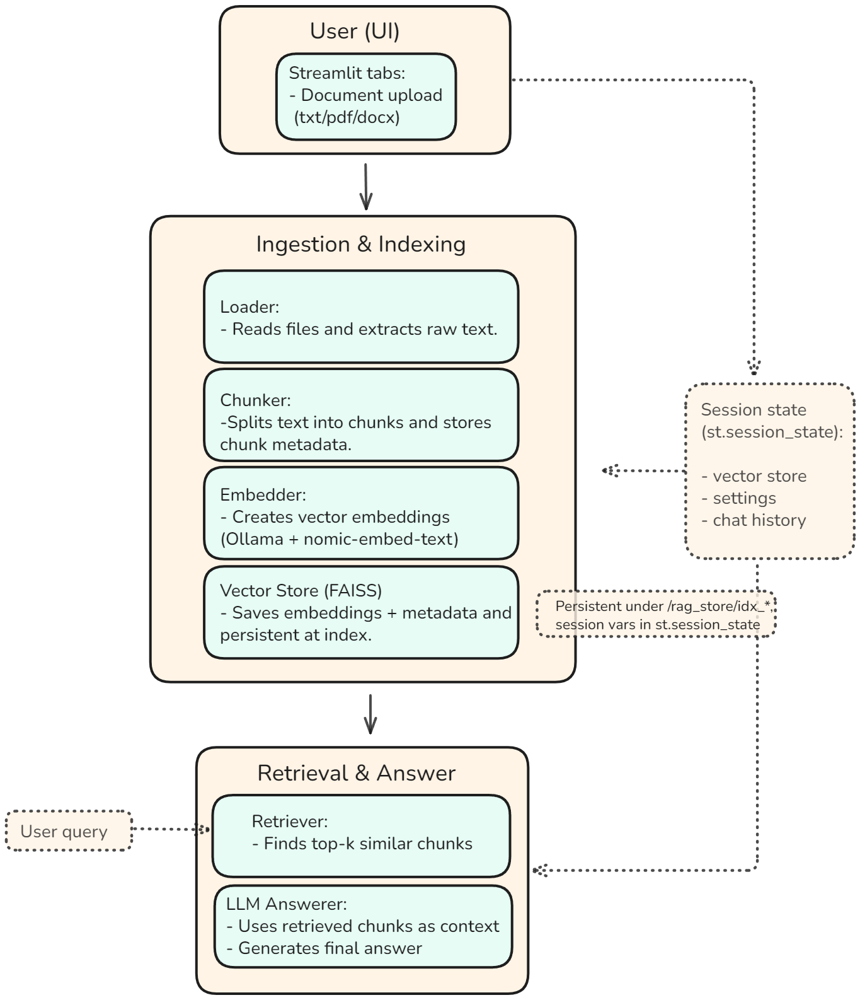

# 🧩 RAG Explorer — Critical Path Overview

## 1. Core Files & Roles

| File | Role |
|------|------|
| `app.py` | Streamlit entry point and full pipeline orchestrator — handles uploads, index build/load, query input, retrieval, and answer display. |
| `rag_core.py` | All data-processing logic: file parsing, chunking, embeddings, FAISS storage, retrieval (dense + BM25 + hybrid). |
| `llm_chain.py` | LLM prompt assembly, provider selection, call execution, and fallback logic. |
| `index_admin.py` | Manage FAISS stores: list, delete, rebuild, add/replace files, and regenerate manifests. |
| `guardrails.py` | Prompt-injection scrubbing, citation enforcement, and export safety filters. |
| `utils/helpers.py` | Timeout wrappers, score stats, and sanitization utilities. |
| `utils/ui.py` | Streamlit-only presentation helpers: expanders, export buttons, copy widgets. |
| `utils/settings.py` | Settings persistence and defaults loader (chunk size, overlap, etc.). |
| `exports.py` | Format-agnostic export (Markdown, CSV, Excel) for answers and metrics. |

---

## 2. High-Level Pipeline

1. **Upload** — Streamlit uploader collects `.pdf`, `.txt`, `.docx`; stored in memory.  
2. **Build Index** — Passes files to `rag_core.build_index_from_files()` which →  
   `files_to_documents()` → `chunk_documents()` → `get_embeddings()` → `build_or_load_vectorstore()` → FAISS save.  
3. **Query** — User question from `st.text_input()` triggers retrieval.  
4. **Retrieve** — `retrieve_with_timeout()` → `rag_core.retrieve()` → returns top-k chunks.  
5. **Filter & Prep** — Normalize hits, filter by score/cap, build snippet rows.  
6. **Prompt Build** — `llm_chain.build_prompt()` merges retrieved text + question (+ history).  
7. **LLM Call** — `llm_chain.call_llm()` sends to Ollama or OpenAI; retries once if needed.  
8. **Answer Display** — Answer rendered, sources expanded, metrics logged, exports available.  

---

## 3. Critical Path — End-to-End Trace

| Step | File | Function | Purpose |
|------|------|-----------|----------|
| 1 | `app.py` | `st.file_uploader()` | User uploads document(s). |
| 2 | `app.py` | `build_index_from_files()` | Creates timestamped FAISS index folder. |
| 3 | `rag_core.py` | `files_to_documents()` | Converts uploads into `Document` objects. |
| 4 | `rag_core.py` | `chunk_documents()` | Splits text into overlapping chunks with IDs. |
| 5 | `rag_core.py` | `get_embeddings()` | Loads `OllamaEmbeddings` model. |
| 6 | `rag_core.py` | `build_or_load_vectorstore()` | Builds FAISS index and saves it locally. |
| 7 | `app.py` | `retrieve_with_timeout()` → `retrieve()` | Searches index for top-k similar chunks. |
| 8 | `rag_core.py` | `retrieve()` | Performs dense, BM25, or hybrid retrieval. |
| 9 | `app.py` | `build_prompt()` | Assembles LLM input from retrieved text. |
|10 | `llm_chain.py` | `call_llm()` | Invokes LLM provider and returns answer text. |
|11 | `app.py` | `build_qa_result()` | Wraps answer + metadata (citations, timings). |
|12 | `app.py` | `st.write(answer_text)` | Displays final answer to user. |

---

## 4. Logging & Observability

| Log Message | Stage |
|--------------|--------|
| `📂 Uploaded ...` | Upload |
| `🚀 Starting index build ...` | Begin build |
| `🧩 Created ... chunks` | Chunking |
| `🔢 Generating embeddings ...` | Embeddings |
| `💾 Index persisted ...` | Storage |
| `❓ Query: ...` | Query capture |
| `📚 Retrieved ... hits` | Retrieval |
| `🧠 Calling LLM...` / `✅ LLM responded` | Generation |
| `✅ Answer generated successfully` | Display |

---

## 5. Artifacts

- **Indexes:** `rag_store/idx_YYYYMMDD_HHMMSS/` — FAISS files + manifest.  
- **Preferences:** `settings.json` — chunking, overlap, provider defaults.  
- **Exports:** Markdown, CSV, Excel (via `exports.py`).  
- **Logs:** printed to Streamlit terminal (INFO-level chronological trace).  

---

**Summary:**  
RAG Explorer v0.2 implements a fully local retrieval-augmented generation workflow with strong engineering hygiene: modular codebase, explicit logging, guardrails, and reproducible FAISS storage. The critical path above defines the exact call sequence from upload to final answer.

---

## 6. System Diagram

**Caption:**  
Assumes a local FAISS index stored under `/rag_store/idx_*`, with Mistral served via Ollama as the default backend.  
Retrieval is limited to top *k* = 5 similar chunks, using local embeddings (`nomic-embed-text`).  
Supports `.txt`, `.pdf`, and `.docx` files through the Streamlit upload interface.
